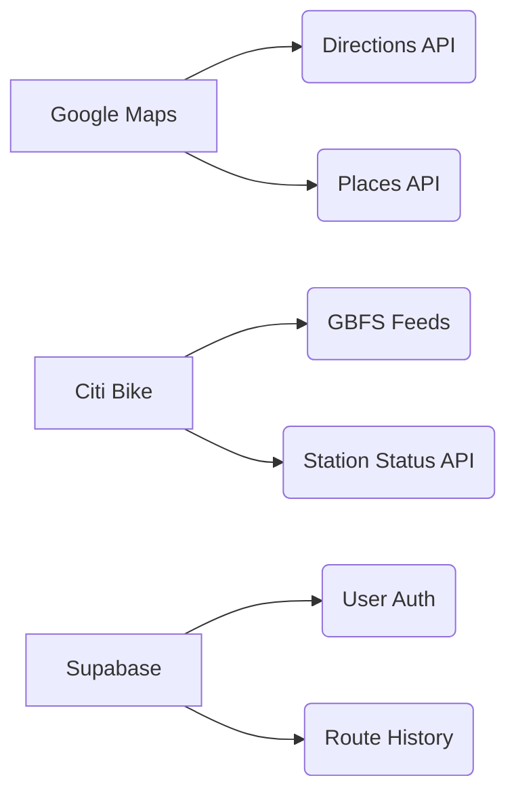

# Bike to Subway Navigator 🚲➡️🚇

## Overview

**Bike to Subway Navigator** is an intelligent route planning tool that optimizes urban commutes by seamlessly combining bike-sharing services with public transit. The application calculates time-efficient routes that replace walking segments with Citi Bike rides, providing multimodal navigation from current location to destination.


## Current Status ✅

### Implemented Features
- [x] **Enhanced Multi-Modal Routing**
  - Walking directions to bike stations
  - Cycling routes between stations
  - Integrated transit directions
- [x] **Real-Time Station Data**
  - Citi Bike availability integration (bikes/docks)
  - GBFS feed parsing with auto-refresh
- [x] **Interactive Mapping**
  - Polylines for walking/biking/transit routes
  - Step-by-step directions with station info
- [x] **Accurate Time Calculations**
  - Combined walking + biking + transit durations
  - Time savings comparison between routes
- [x] **Modern UI Components**
  - Search with autocomplete
  - Route cards with detailed breakdowns
  - Collapsible direction steps

### In Development 🚧
- [ ] User preference settings
- [ ] Real-time transit updates
- [ ] Advanced route optimization
- [ ] Mobile app integration

## Technical Stack ⚙️

### Core Technologies
- **Frontend**: Next.js 14 (App Router), TypeScript
- **Styling**: Tailwind CSS, shadcn/ui components
- **Maps**: Google Maps JavaScript API
- **State Management**: React Context + Zustand
- **Build**: Vite + SWC

### Key Integrations


## Key Features 🌟

### Smart Routing Engine
- **Multi-Modal Combinations**  
  `Walking → Citi Bike → Subway → Walking`
- **Station Availability Filtering**
  - Finds nearest bike station with available bikes
  - Locates optimal dock station near transit entry
- **Time Optimization**  
  Auto-selects fastest combination of transportation modes

### Interactive Experience
- **Step-by-Step Directions**
  ```tsx
  <StepDetails 
    mode={step.mode} 
    station={step.station} 
    duration={step.duration}
  />
  ```
- **Visual Mapping**
  - Color-coded route segments (blue=walk, green=bike, red=transit)
  - Station markers with live availability

### Performance
- Client-side caching of station data
- Dynamic API loading for Google Maps
- Abortable fetch requests for sequential searches

## Development Setup 💻

### Requirements
- Node.js v18+
- Google Cloud API key with:
  - Maps JavaScript API
  - Directions API
  - Places API
- Citi Bike GBFS API access

### Installation
```bash
git clone https://github.com/your-repo/bike-to-subway.git
cd bike-to-subway

# Install dependencies
npm install

# Configure environment
cp .env.example .env.local
# Add your API keys

# Start dev server
npm run dev
```

### Scripts
| Command | Description |
|---------|-------------|
| `dev` | Start development server |
| `build` | Create production build |
| `lint` | Run ESLint checks |
| `typecheck` | Verify TypeScript types |

## Deployment 🚀

### Static Export
```bash
bun run build
bun run start
```

## Roadmap 🗺️

### Next Features
1. Real-time station availability updates
2. User preference profiles
3. Route sharing capabilities
4. Progressive Web App support

### Optimization Targets
- Map rendering performance
- Route calculation speed
- Bundle size reduction

## License 📄
MIT License - See [LICENSE.TXT](/LICENSE.TXT) for details

## Contact 📧
**Walsh Kang**  
[wkang1281@gmail.com](mailto:wkang1281@gmail.com)  
[GitHub Profile](https://github.com/walshkang)